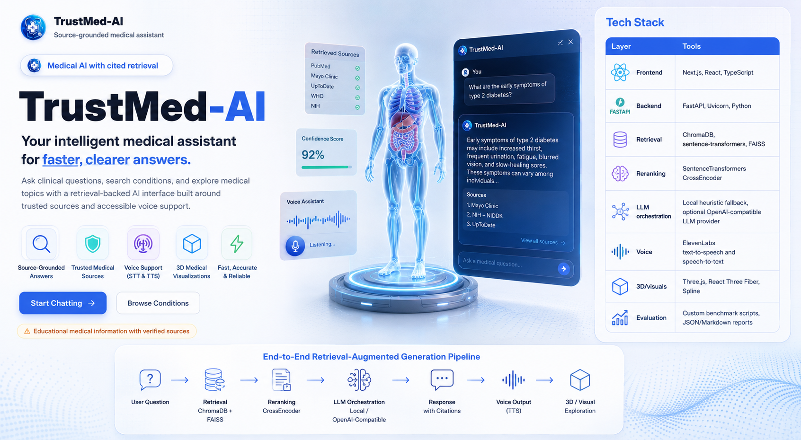
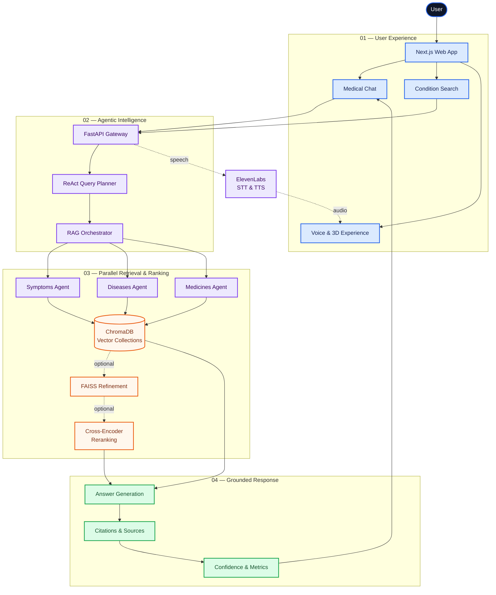

# TrustMed-AI

<p align="center">
  <a href="TrustMed-AI/">
    
  </a>
</p>

<p align="center">
  <strong>Source-grounded medical intelligence with transparent retrieval, citations, and voice accessibility.</strong>
</p>

<p align="center">
  
  
  
  
</p>

TrustMed-AI is a full-stack, source-grounded medical question-answering assistant built around an agentic RAG pipeline. It pairs a polished Next.js experience with a FastAPI orchestration backend, ChromaDB retrieval, optional FAISS refinement, optional cross-encoder reranking, ReAct-style routing traces, and ElevenLabs voice input/output.

I built this as a portfolio-grade AI engineering project: the focus is not just generating answers, but showing the retrieval path, citations, confidence signals, evaluation reports, and user-facing interaction details that make an AI product easier to trust.

> [!IMPORTANT]
> **Educational project only.** TrustMed-AI is not a medical device and should not be used as a substitute for a licensed clinician.

## Recruiter-Friendly Snapshot

| Area | What this project demonstrates |
|---|---|
| Full-stack product engineering | Next.js, React, TypeScript frontend connected to a FastAPI backend |
| Applied AI/RAG | Agentic retrieval across symptoms, diseases, and medicines collections |
| Search and ranking | ChromaDB vector search, optional FAISS refinement, and cross-encoder reranking |
| Explainability | ReAct-style Thought → Action → Observation routing traces and cited responses |
| Evaluation mindset | Precision@K, MRR, keyword coverage, grounding-risk checks, and saved benchmark reports |
| UX polish | 3D doctor avatar, word-by-word answer rendering, source cards, voice input, and TTS playback |

## Product Highlights

- Ask medical questions and receive source-grounded answers with citations.
- Browse disease and condition information through a dedicated frontend view.
- Route queries across specialized retrieval agents for symptoms, diseases, and medicines.
- Inspect confidence, response time, retrieved sources, and metadata in the chat UI.
- Use accessibility-focused voice features with speech-to-text and text-to-speech.
- Run repeatable retrieval and faithfulness evaluations from local benchmark scripts.

## Architecture



## Current Capabilities

- Full-stack app with a Next.js frontend and FastAPI backend.
- Medical RAG over three ChromaDB collections: `symptoms`, `diseases`, and `medicines`.
- Agentic retrieval orchestration with per-collection agents and response aggregation.
- Parallel agent execution with `ThreadPoolExecutor`.
- Optional FAISS refinement over Chroma candidates.
- Optional cross-encoder reranking with `cross-encoder/ms-marco-MiniLM-L-6-v2`.
- ReAct-style routing trace exposed in API responses for explainability.
- ElevenLabs TTS and STT endpoints for accessibility.
- Spline hero visual on the landing page using a local `.splinecode` asset.
- Interactive Three.js doctor avatar with zoom/rotate controls on the chat welcome screen.
- Word-by-word generated response rendering with compact markdown bullets.
- Verified source cards and response metadata in the chat answer view.
- Polished quick search, disease browser, and sidebar UI with medical-grid styling.
- Indexed local knowledge base with 9K+ medical chunks and hundreds of condition profiles.
- 100-prompt evaluation dataset across five medical domains.
- Precision@K retrieval evaluator.
- Faithfulness and hallucination-risk evaluator.
- Benchmark reports written to `benchmark_results/`.

## Tech Stack

| Layer | Tools |
|---|---|
| Frontend | Next.js, React, TypeScript |
| Backend | FastAPI, Uvicorn, Python |
| Retrieval | ChromaDB, sentence-transformers, FAISS |
| Reranking | SentenceTransformers CrossEncoder |
| LLM orchestration | Local heuristic fallback, optional OpenAI-compatible LLM provider |
| Voice | ElevenLabs text-to-speech and speech-to-text |
| 3D/visuals | Three.js, React Three Fiber, Spline |
| Evaluation | Custom benchmark scripts, JSON/Markdown reports |

## Repository Map

```text
TrustMed-AI/
  anti_test.py                     # Agentic RAG orchestrator
  trustmed_api.py                  # FastAPI app and API routes
  react_router.py                  # ReAct-style retrieval planner
  voice_service.py                 # ElevenLabs TTS/STT integration
  sql_to_chroma.py                 # Chroma ingestion/chunking pipeline
  benchmark_agentic_rag.py         # Latency and keyword-coverage benchmark
  evaluate_retrieval_precision.py  # Precision@K retrieval evaluator
  evaluate_faithfulness.py         # Grounding and hallucination-risk evaluator
  evaluation_dataset_100.json      # 100-prompt evaluation set
  benchmark_results/               # Generated benchmark reports
  src/                             # Next.js app source
  chroma_db/                       # Local persistent ChromaDB store
```

## Environment Variables

Create a `.env` file in `TrustMed-AI/`. Do not commit real secrets.

```bash
OPENAI_API_KEY=your_openai_key
OPENAI_MODEL=gpt-4o-mini

ELEVENLABS_API_KEY=your_elevenlabs_key
ELEVENLABS_VOICE_ID=JBFqnCBsd6RMkjVDRZzb
ELEVENLABS_TTS_MODEL=eleven_multilingual_v2
ELEVENLABS_STT_MODEL=scribe_v1

CHROMA_DB_DIR=./chroma_db
EMBEDDING_MODEL_NAME=sentence-transformers/all-MiniLM-L6-v2

ENABLE_FAISS_REFINEMENT=true
ENABLE_CROSS_ENCODER_RERANKING=true
CROSS_ENCODER_MODEL=cross-encoder/ms-marco-MiniLM-L-6-v2
CROSS_ENCODER_TOP_N=8
```

## Local Setup

Install frontend dependencies:

```bash
cd TrustMed-AI
npm install
```

Install backend dependencies:

```bash
python3 -m venv trustmed_env
source trustmed_env/bin/activate
pip install -r requirements.txt
```

## Run the Backend

```bash
cd TrustMed-AI
source trustmed_env/bin/activate
ENABLE_FAISS_REFINEMENT=true \
ENABLE_CROSS_ENCODER_RERANKING=true \
CROSS_ENCODER_TOP_N=8 \
python -m uvicorn trustmed_api:app --host 127.0.0.1 --port 8000
```

Backend health check:

```bash
curl http://127.0.0.1:8000/
```

## Run the Frontend

In a second terminal:

```bash
cd TrustMed-AI
npm run dev
```

Open:

```text
http://localhost:3000
```

## Main API Endpoints

| Method | Endpoint | Purpose |
|---|---|---|
| `GET` | `/` | Backend health and endpoint summary |
| `POST` | `/medical/query` | Main medical QA endpoint |
| `GET` | `/diseases/categories` | Disease category metadata |
| `POST` | `/voice/text-to-speech` | Convert answer text to audio |
| `POST` | `/voice/speech-to-text` | Transcribe uploaded speech |

Example query:

```bash
curl -X POST http://127.0.0.1:8000/medical/query \
  -H "Content-Type: application/json" \
  -d '{"query":"What are symptoms of diabetes?"}'
```

Example TTS:

```bash
curl -s -o /tmp/trustmed_voice_test.mp3 \
  -X POST http://127.0.0.1:8000/voice/text-to-speech \
  -H "Content-Type: application/json" \
  -d '{"text":"TrustMed AI voice test."}'
```

## Evaluation

The project includes a 100-prompt dataset in `evaluation_dataset_100.json`. It spans five domains:

- Endocrine and metabolic health
- Cardiovascular health
- Respiratory and allergy health
- Neurology and mental health
- Musculoskeletal, infectious, and general medicine

Run the agentic RAG benchmark:

```bash
python benchmark_agentic_rag.py --dataset evaluation_dataset_100.json --limit 20
```

Run retrieval precision@K:

```bash
python evaluate_retrieval_precision.py --dataset evaluation_dataset_100.json
```

Run faithfulness and hallucination-risk checks:

```bash
python evaluate_faithfulness.py --dataset evaluation_dataset_100.json --limit 20
```

Reports are written to:

```text
benchmark_results/
```

## Metrics Explained

| Metric | Meaning |
|---|---|
| Precision@K | Fraction of top-K retrieved chunks that match expected collection and medical concept signals |
| Collection hit rate | Whether the top-K results include the expected source collection |
| MRR | How early the first relevant chunk appears |
| Keyword coverage | Whether generated answers include expected medical concepts |
| Grounded score | Heuristic composite of citations, links, docs used, expected concepts, safety language, and risky phrasing |
| Latency | End-to-end orchestration time for each RAG mode |

## Resume-Safe Claim Examples

The following claims are appropriate after running and saving the matching reports:

- Built a full-stack medical RAG assistant using Next.js, FastAPI, ChromaDB, FAISS, cross-encoder reranking, and ElevenLabs voice APIs.
- Designed an agentic RAG backend that routes queries across symptoms, diseases, and medicines retrieval agents.
- Added optional FAISS refinement and cross-encoder reranking to improve retrieval ordering before answer generation.
- Created a 100-prompt medical QA evaluation suite across five domains.
- Implemented precision@K, collection hit rate, MRR, keyword coverage, and grounding-risk evaluation reports.
- Integrated voice accessibility with text-to-speech and speech-to-text endpoints.

Avoid claiming clinical accuracy, production HIPAA compliance, or final deployment unless those are separately verified and documented.

## Demo Flow

1. Start the backend with FAISS and cross-encoder flags enabled.
2. Start the Next.js frontend.
3. Ask: `What are the symptoms of diabetes?`
4. Show word-by-word answer rendering, source cards, confidence, response time, and listen/copy controls.
5. Mention that the ReAct-style routing trace is available in the API response/backend logs for developer explainability.
6. Use the listen button to play the answer through ElevenLabs TTS.
7. Use microphone input to test speech-to-text.
8. Run a small benchmark sample:

```bash
python evaluate_retrieval_precision.py --dataset evaluation_dataset_100.json --limit 10
python evaluate_faithfulness.py --dataset evaluation_dataset_100.json --limit 10
```

## Limitations

- The evaluation scripts are project benchmarks, not clinical validation.
- Faithfulness scoring is heuristic and should be interpreted as hallucination-risk tracking.
- The local ChromaDB dataset determines answer quality; incomplete source data can still produce weak answers.
- ElevenLabs and OpenAI features require valid API keys.
- Medical answers should encourage users to consult qualified healthcare professionals for diagnosis and treatment decisions.

---

<p align="center">
  <strong>Built to make medical AI answers more transparent, traceable, and trustworthy.</strong>
</p>
